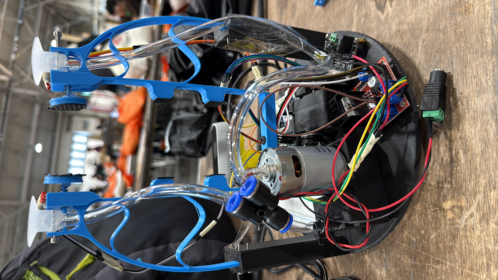

# Multimodal Compliant Gripper with Force Feedback

> 🏆 **1st Place — Ford ATP Industrial Grasping Challenge** | Overall Honorable Mention  
> StarkHacks 2026 · Purdue University · 750+ Participants · Prize: Bambu Lab P2S

[](https://youtu.be/Yh4Lk9BP-3s?si=-_aqBTfUtQdCBHEU)
[]([https://devpost.com](https://devpost.com/software/multimodal-compliant-gripper-with-force-feedback))
[]()

---

## Overview

A self-adaptive robotic grasper that combines **passive mechanical compliance**, **computer vision**, and **real-time Hall effect force feedback** to reliably grasp a wide variety of industrial objects without manual reconfiguration.

Built in 36 hours at StarkHacks 2026, tested on Ford automotive parts including spark plugs, lug nuts, piston rods, sheet metal, and more. Demonstrated on a Universal Robots UR10e cobot.



---

## How It Works

### Grasp Decision Pipeline

```
RealSense D435i → SAM3 Segmentation → Depth Fusion → Grasp Classification → MQTT Command → Arduino Q → Actuator
```

1. **Capture** — Intel RealSense D435i streams aligned RGB + depth at 640×480 30fps
2. **Segment** — SAM3 via Roboflow API generates polygon masks for target objects
3. **Depth Fuse** — Mask projected onto depth matrix, point cloud extracted
4. **Classify** — Depth gap > 7 or std > 30 → `FINGER_GRASP`, else → `VACUUM`
5. **Execute** — MQTT command sent to Arduino Q, servo or pump actuated, Hall sensor monitors force

### Grasp Modes

| Mode | Trigger | Actuator |
|------|---------|----------|
| `FINGER_GRASP` | Hollow objects, irregular surfaces | SC Servo → compliant jaw |
| `VACUUM` | Large flat surfaces | DC pump → suction cups |

---

## System Architecture

### Three-Layer Control

```
[ Remote Client ]  ←→  MQTT  ←→  [ Linux Python Bridge ]  ←→  ArduinoBridge  ←→  [ Arduino Q ]
  mqtt_client.py                   mqtt_server_starkhacks.py                      mcu_starkhacks.ino
  - Send commands                  - Route MQTT to MCU                            - Servo control
  - Read force data                - Publish sensor data @ 20Hz                   - Pump PWM
                                   - Threading for async ops                      - Hall sensor read
```

### Force Feedback

Hall effect sensor reads displacement of a spring-loaded magnet in the fingertip. Displacement maps to contact force via:

```
F = -0.016 × M + 11.4   (calibrated linear regression, F in Newtons)
```

Where `M` is the raw analog Hall sensor reading. Published over MQTT at 20Hz for real-time monitoring.

---

## Hardware

| Component | Role |
|-----------|------|
| Compliant PLA fingers | Passive shape adaptation via flexure geometry |
| SC Servo (ID 1) | Jaw open/close, position range 1000–2200 |
| DC Vacuum Pump | Suction cup actuation, PWM controlled (0–255) |
| Suction Cups (×2) | Flat surface grasping |
| Hall Effect Sensor | Contact force estimation |
| Spring + Magnet | Displacement-to-force transduction |
| Arduino Q | MCU: all sensor reads + actuator control |
| Intel RealSense D435i | RGB-D perception, mounted on gripper |
| Linux laptop | MQTT broker + Python bridge server |
| UR10e | Robot arm (ISO 9409-1-50-4-M6 mount) |

---

## Repository Structure

```
├── src/
│   ├── mcu_starkhacks.ino          # Arduino Q firmware
│   ├── mqtt_server_starkhacks.py   # Linux bridge server
│   ├── mqtt_client.py              # Remote command client
│   └── computer_vision.py          # Vision pipeline + grasp analysis
├── cad/
│   └── *.SLDPRT / *.STL            # SolidWorks CAD + print-ready files
└── README.md
```

---

## Software Setup

### Requirements

```bash
pip install paho-mqtt pyrealsense2 open3d opencv-python inference-sdk numpy
```

### Run

**1. Flash Arduino Q** with `src/mcu_starkhacks.ino`

**2. Start Linux bridge** (on robot laptop):
```bash
python src/mqtt_server_starkhacks.py
```

**3. Start vision pipeline** (point RealSense at scene, press `C` to capture):
```bash
python src/computer_vision.py
```

**4. Start remote client** (any machine on same network):
```bash
python src/mqtt_client.py
```

### Client Commands

| Key | Action |
|-----|--------|
| `i` | Increase grip |
| `d` | Decrease grip |
| `r` | Release / reset |
| `p` | Pump ON |
| `o` | Pump OFF |
| `q` | Quit |

---

## Printing the Gripper

CAD files are in `/cad/`. Print settings:

- **Material**: PLA
- **Infill**: 20–30% for compliant fingers, 60%+ for structural mounts
- **Layer height**: 0.2mm
- **Supports**: Required for finger flexure zones
- **Printer**: Any FDM — tested on Bambu Lab P2S

---

## Team

| Name | Contribution |
|------|-------------|
| Sanjay Jayalakshmi Prabakar | Arduino Q MCU and Linux, Hall effect force feedback, vacuum/servo control |
| Sukesh J. Ranganathan | Mechanical design, CAD, 3D printing, assembly |
| Sai Siddartha Alleni | Vision pipeline, MQTT architecture |
| Yalamanchili Varshitha | Vision pipeline, Roboflow/SAM3 integration |

---

## Results

Tested on Ford automotive parts: spark plug, lug nut, piston rod, sheet metal, cabin air filter, door handle, wire harness, and more.

**[Watch full demo →](https://youtu.be/v_XWHwukWWc)**

---

## Built With

`Arduino Q` `Python` `MQTT` `SAM3` `Roboflow` `Intel RealSense` `PyRealSense2` `Open3D` `OpenCV` `SolidWorks` `SC Servo` `Universal Robots UR10e`

---

*StarkHacks 2026 · Humanoid Robotics Club · Purdue University · April 17–19, 2026*
